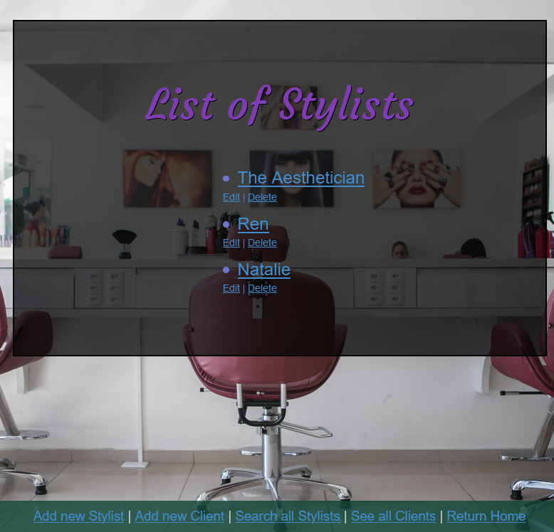
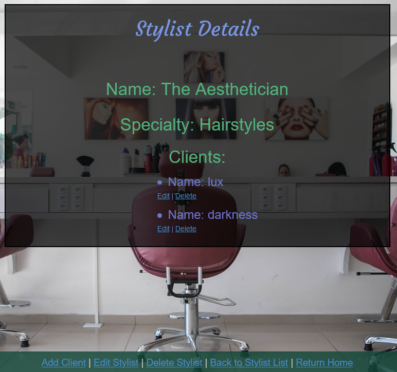

# _[Hair Salon](https://github.com/TSiu88/HairSalon)_

#### _Week 11 Friday Independent Assignment, 03.20.2020_

#### By _**Tiffany Siu**_

---
## Table of Contents
1. [Description](#description)
2. [Setup/Installation Requirements](#setup/installation-requirements)
    - [Requirements to Run](#requirements-to-run)
    - [Instructions](#instructions)
    - [Other Technologies Used](#other-technologies-used)
3. [Notable Features](#notable-features)
4. [Specifications](#specifications)
5. [User Stories](#user-stories)
6. [Screenshots](#screenshots)
7. [Known Bugs](#known-bugs)
8. [Support and Contact Details](#support-and-contact-details)
9. [License](#license)
---
## Description

This application is the Week 11 Friday independent assignment for Epicodus' full time Intro to Programming and C#/React course.  This application was made to show using the MVC file structure, Entity Framework, and MySQL database to make objects within objects with a one-to-many relationship.

This web application allows a user, the owner of the Salon, to manage her employees (stylists) and their clients.  This keeps a list of stylists that are currently working at the salon and a list of their clients within each stylist.  It also keeps some information on each of the parties involved like everyone's name.  The application allows the user to add stylists and clients onto the lists and edit or delete entries as needed.

## Setup/Installation Requirements

_This program requires .NET Core SDK to run. [Here is a free tutorial](https://www.learnhowtoprogram.com/c-and-net/getting-started-with-c/installing-c-and-net) for installing .NET on Mac or Windows 10 from the [official website](https://dotnet.microsoft.com/download/dotnet-core/)._ 

_This program also makes use of SQL databases. We recommend using MySQL Workbench to build your databases. [Here is a free tutorial](https://www.learnhowtoprogram.com/c-and-net/getting-started-with-c/installing-and-configuring-mysql) for installing MySQL WorkBench and MySQL Community Server on Mac (using links [Mac1](https://dev.mysql.com/downloads/file/?id=484914) and [Mac2](https://dev.mysql.com/downloads/file/?id=484391)) or [Windows 10](https://dev.mysql.com/downloads/file/?id=484919)._

### Requirements to Run
* _.NET Core_
* _ASP.NET Core MVC_
* _MySQL Workbench_
* _MySQL Community Server_
* _Entity Framework_
* _Command Prompt_
* _Web Browser_

### Instructions

*This application may be viewed by:*

1. Download and install .NET Core from the [official website](https://dotnet.microsoft.com/download/dotnet-core/)
2. Download and install MySQL Workbench and Community Server for Mac or Windows by following the instructions [here](https://www.learnhowtoprogram.com/c-and-net/getting-started-with-c/installing-and-configuring-mysql).
3. Click clone the [repository](https://github.com/TSiu88/HairSalon.git) from my [GitHub page](https://github.com/TSiu88) to copy the repository link
4. Use a command line interface to type `git clone (repository-link-here)` to copy the project into the current folder and then move into the repository's directory that was just created with `cd (project-name-here)`
5. Start up a local server by opening MySQL Workbench and adding a `MySQL Connections` using the default IP address and Port (IP 127.0.0.1, Port 3306), username (root), and password from setup.
6. Construct the database by entering in the following lines under the `Query` section and then clicking execute:
  >
    CREATE DATABASE tiffany_siu;
    USE tiffany_siu;
    CREATE TABLE stylists (stylistId serial PRIMARY KEY, stylistName VARCHAR(255), specialty VARCHAR(255));
    CREATE TABLE clients (clientId serial PRIMARY KEY, clientName VARCHAR(255), phoneNumber VARCHAR(15), stylistId INT);
7. Run `dotnet restore` and `dotnet build` in command line interface of the repository's main project directory
8. Run `dotnet run` to start up the program in the command line interface
9. Type the URL listed under "Now listening on:" into a web browser to run

## Other Technologies Used
* _C#_
* _HTML_
* _CSS_
* _MSTest_
* _Razor_
* _Markdown_

## Notable Features
This application is able to search, edit, and delete objects and return the search results as a link to see details on the search results found.

## Specifications

  
Click to expand to view specifications

| Specification | Input | Output |
| :-------------     | :------------- | :------------- |
| The application displays a home page welcome message and links to view lists of stylists and clients and add to lists | Application start | Homepage displayed |
| The application displays a list of stylists that can navigate to details on a specific stylist or add a stylist or client | Stylists List page | List of stylists and links to details on each stylist with link to add new stylists or clients |
| The application displays details and a list of clients for a specific stylist | Stylist details page | Display name, specialty, and client list |
| The application allows clients to be added with a specific stylist | Add client A with stylist B | New client A added under stylist B and appears on stylist B's client list |
| If no stylists have been added, no clients can be added because adding clients require a stylist to be chosen | Add client B when 0 stylists in database | "Unable to add, no stylists in system!" |

## User Stories

* As the salon owner, I need to be able to see a list of all stylists.
* As the salon owner, I need to be able to select a stylist, see their details, and see a list of all clients that belong to that stylist.
* As the salon owner, I need to add new stylists to our system when they are hired.
* As the salon owner, I need to be able to add new clients to a specific stylist. I should not be able to add a client if no stylists have been added.

## Screenshots

_Here is a snippet of what the homepage looks like:_

_Here is a preview of what the stylist list page looks like:_

_Here is a preview of what the stylist details look like:_

_Here is a preview of what the client list page looks like:_

## Known Bugs

_There are currently no known bugs in this program_

## Support and contact details

_If there are any question or concerns please contact me at my [email](mailto:tsiu88@gmail.com). Thank you._

### License

*This software is licensed under the MIT license*

Photo Credit: 
[Photo by Guilherme Petri](https://unsplash.com/photos/PtOfbGkU3uI) on Unsplash

Copyright (c) 2020 **_Tiffany Siu_**
